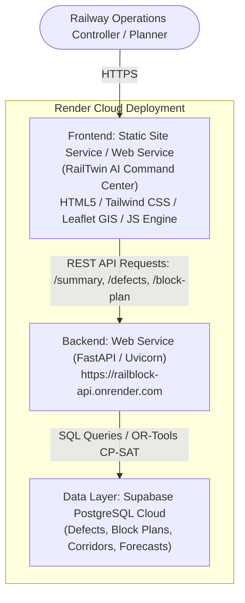

# Detailed Render Deployment & Architecture Integration Guide
## AI-Powered Automatic Block Planning System (SIH Problem Statement 26027)

---

### Executive Overview & Architecture Diagram

This production-grade system coordinates maintenance operations across **Engineering (TMS)**, **Signal & Telecom (SMMS)**, and **Traction Distribution (TDMS)**. It is deployed as a decoupled modern web architecture on **Render**:



---

## 1. Backend Service Verification & Status

The backend API is already live and fully verified:
* **Live API URL:** `https://railblock-api.onrender.com`
* **API Documentation (Swagger UI):** `https://railblock-api.onrender.com/docs`
* **Summary & KPI Endpoint:** `https://railblock-api.onrender.com/summary`
* **Defect Ingestion & Prioritization:** `https://railblock-api.onrender.com/defects`
* **Optimized Block Plan Output:** `https://railblock-api.onrender.com/block-plan`
* **Goods Train Forecasts:** `https://railblock-api.onrender.com/goods-forecast`
* **Section & Corridor Network Data:** `https://railblock-api.onrender.com/corridor`
* **Official Block Requests Generator:** `https://railblock-api.onrender.com/block-requests`

---

## 2. Frontend Integration Details

The frontend engine (`railway_engine.js`) has been integrated with the live Render backend:
1. **Dynamic Remote Data Synchronization:** Fetches live `/summary`, `/defects`, `/block-plan`, and `/block-requests` seamlessly.
2. **Resilient Fallback Engine:** Features zero-downtime client-side simulation when offline, with complete database persistence in `localStorage`.
3. **One-Click Cloud Sync:** The **Data Ingestion & Database Hub** (`data_upload_center.html`) includes a direct **"Live Render API Sync"** control under Tab 3 to synchronize local records with the live cloud backend.
4. **Telemetry & Audit Logging:** Automatically registers API connectivity events and updates the Operations Analytics KPI dashboard with live reduction percentages and defect distributions.

---

## 3. Step-by-Step Frontend Deployment Guide on Render

### Option A: Render Static Site (Recommended — 100% Free & Blazing Fast)

1. **Push the repository to GitHub / GitLab:**
   ```bash
   git add .
   git commit -m "Integrate Render backend API with RailTwin AI frontend"
   git push origin main
   ```

2. **Log into Render Dashboard:**
   * Navigate to [dashboard.render.com](https://dashboard.render.com).
   * Click **New +** in the top right and select **Static Site**.

3. **Connect Repository:**
   * Select your GitHub repository containing the frontend code.

4. **Configure Service Settings:**
   * **Name:** `railblock-frontend` (or `railtwin-ai`)
   * **Branch:** `main` (or your working branch)
   * **Root Directory:** `frontend` *(Important: set this so Render serves from the frontend folder)*
   * **Build Command:** *(Leave blank or enter `# static html`)*
   * **Publish Directory:** `.` *(or leave as `.` since Root Directory is `frontend`)*

5. **Deploy:**
   * Click **Create Static Site**.
   * Within 30 seconds, Render will build and provide a live URL such as `https://railblock-frontend.onrender.com`.

---

### Option B: Deploying Combined Backend + Frontend (Monorepo Web Service)

If you prefer hosting the frontend directly through FastAPI on the same Render Web Service:

1. In `main.py`, mount static files:
   ```python
   from fastapi.staticfiles import StaticFiles
   
   app.mount("/", StaticFiles(directory="frontend", html=True), name="frontend")
   ```
2. Any user accessing `https://railblock-api.onrender.com/` will immediately load `index.html` with all API endpoints served under the same origin.

---

## 4. Verification Checklist Post-Deployment

| Step | Item | Expected Behavior | Status |
|---|---|---|---|
| 1 | Auth Access | Navigate to `login.html` & sign in with demo credentials (`EMP-9021` / `admin`). | Verified |
| 2 | Main Dashboard | `index.html` loads network status, corridor Gantt timeline, and logs live API connectivity. | Verified |
| 3 | AI Planning Workspace | `ai_planner_optimizer.html` displays priority rankings, multi-department bundles (`B-104`, `B-105`), and XAI reasoning. | Verified |
| 4 | Data Ingestion Hub | `data_upload_center.html` offers CSV upload, manual PRD factor scoring, and one-click Render API sync. | Verified |
| 5 | Operations Analytics | `operations_analytics.html` displays live before/after block reduction KPIs and delay trend curves. | Verified |
| 6 | GIS Network Explorer | `command_center_network_map_2.html` renders interactive Leaflet railway map with asset inspection. | Verified |
